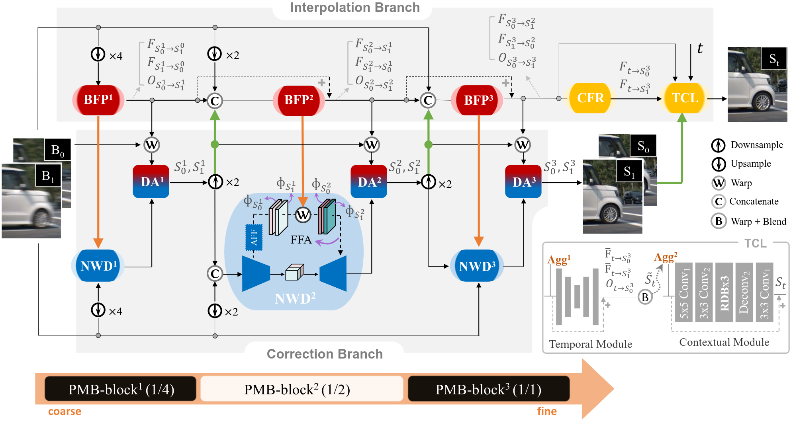

## Rethinking Video Frame Interpolation from Shutter Mode Induced Degradation
  [Paper](https://openaccess.thecvf.com/content/ICCV2023/papers/Ji_Rethinking_Video_Frame_Interpolation_from_Shutter_Mode_Induced_Degradation_ICCV_2023_paper.pdf) | [Supp](https://openaccess.thecvf.com/content/ICCV2023/supplemental/Ji_Rethinking_Video_Frame_ICCV_2023_supplemental.pdf) | [Video](https://drive.google.com/file/d/1opbVtfsuPNvAw9XvdlTIPysb8eOs4PTD/view?usp=sharing)

Xiang Ji<sup>1</sup>, Zhixiang Wang<sup>1,2</sup>, Zhihang Zhong<sup>1,2</sup>, Yinqiang Zheng<sup>1</sup>

<sup>1</sup>The University of Tokyo&nbsp;&nbsp;<sup>2</sup>National Institute of Informatics&nbsp;&nbsp;
#### TL;DR
In this paper, we present the first real-world dataset for learning and benchmarking degraded video frame interpolation, named RD-VFI, and further explore the performance differences of three types of degradations, including GS blur, RS distortion, and an in-between effect caused by the rolling shutter with global reset (RSGR), thanks to our novel quad-axis imaging system. Moreover, we propose a unified Progressive Mutual Boosting Network (PMBNet) model to interpolate middle frames at arbitrary time for all shutter modes. Its disentanglement strategy and dual-stream correction enable us to adaptively deal with different degradations for VFI.



## Dependencies
1. Python and Pytorch
- Pyhotn=3.8 (Anaconda recommended)
- Pytorch=1.11.0
- CUDA=11.3/11.4
``` shell
conda create -n pmbnet python=3.8
conda activate pmbnet
conda install pytorch==1.11.0 torchvision==0.12.0 torchaudio==0.11.0 cudatoolkit=11.3 -c pytorch

####  please install detron2 using command as bellow
python -m pip install 'git+https://github.com/facebookresearch/detectron2.git'
```

2. Other packages
``` shell
pip install -r requirements.txt
```
## Data and Pretrained Model
- Download datasets [RD_VFI](https://drive.google.com/file/d/19RQzMoieKcLP92F4whVzoAXNXG3XaoiQ/view) and synthetic data [GOPRO-VFI_copy]() based on [GOPRO](https://drive.google.com/file/d/1rJTmM9_mLCNzBUUhYIGldBYgup279E_f/view).
- Unzip them under a specified directory by yourself.
- Please download checkpoints from this [link](https://drive.google.com/drive/folders/172pk7ppPmbLkcaNvYyO4OOXgn0Ia9SR_?usp=sharing) and put them under root directory of this project.


